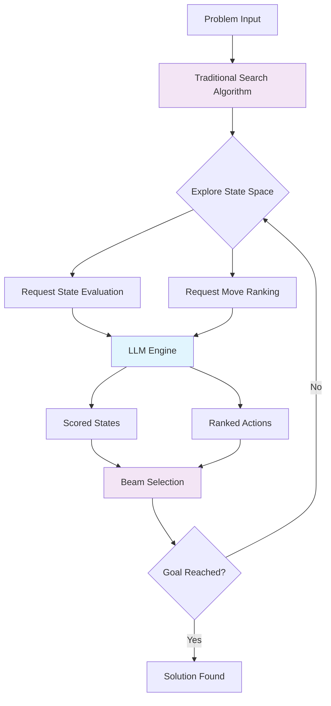

# Beyond the Illusion: Using LLMs as Software Components, Not Magic Black Boxes

Apple's recent paper ["The Illusion of Thinking"](https://ml-site.cdn-apple.com/papers/the-illusion-of-thinking.pdf) delivers a sobering reality check about Large Language Models (LLMs). Their meticulous research reveals that these models aren't truly "reasoning" in the sophisticated way we might hope. As problem complexity increases, these systems experience complete accuracy collapse, failing to develop generalizable problem-solving capabilities and counterintuitively reducing their reasoning effort when confronted with harder challenges.

But here's where I think we need to reframe the conversation: this isn't a failure of LLMs themselves—it's a fundamental misunderstanding of how we should be using them.

## The Misguided Quest for the Universal Reasoner

Apple's research team put state-of-the-art reasoning models through their paces using controlled puzzle environments like Tower of Hanoi, demonstrating that when we ask LLMs to solve complex reasoning problems end-to-end, they hit insurmountable walls. The models struggle with exact computation, maintaining algorithmic consistency, and scaling their reasoning effort appropriately with problem complexity. When faced with Tower of Hanoi puzzles involving 8 or more disks, these supposedly "reasoning" models simply collapse.

This shouldn't come as a shock. LLMs are sophisticated pattern matching systems trained on vast amounts of text, not formal reasoning engines. Expecting them to perform like specialized algorithms is fundamentally misguided—like expecting a brilliant linguist to suddenly become a mathematician simply because they can articulate mathematical concepts beautifully.

## A Different Approach: LLMs as Intelligent Software Components

What if instead of treating LLMs as all-encompassing reasoning machines, we positioned them as intelligent software components within traditional algorithmic frameworks? This perspective transforms apparent limitations into opportunities for thoughtful system design.

The magic happens when we let each component do what it does best. Each brings unique strengths that complement the other's weaknesses:

| **LLMs Excel At** | **Traditional Algorithms Excel At** |
|-------------------|-------------------------------------|
| Pattern recognition across complex, high-dimensional data | Systematic exploration of solution spaces |
| Heuristic evaluation based on learned patterns | Exact computation and mathematical operations |
| Strategic assessment using contextual understanding | Constraint satisfaction and optimization |
| Handling ambiguous or ill-defined problem aspects | Guaranteeing completeness and optimality |
| Rapid adaptation to new problem variations | Consistent, deterministic behavior |
| Integrating multimodal information (text, context, domain knowledge) | Efficient search through large state spaces |
| Approximate reasoning when perfect solutions are intractable | Maintaining algorithmic correctness and formal properties |

This complementary relationship is the key insight: LLMs provide the nuanced evaluation and pattern recognition that would be incredibly complex to encode algorithmically, while traditional algorithms handle the systematic computation and formal reasoning that LLMs struggle with. Rather than competing, they form a symbiotic partnership where each handles what it does best.

## The Key: Scoped LLM Function Calls

The fundamental difference between Apple's approach and this hybrid methodology lies in how we scope LLM interactions. Rather than asking the LLM to handle the entire problem end-to-end—as Apple's research demonstrates—we treat LLM calls as narrowly focused functions within our application architecture.

Instead of one monolithic "solve this problem" call, we design multiple, highly specific function calls that each handle a single aspect of the larger reasoning process. Each call has a narrow, well-defined responsibility with structured inputs and outputs, allowing them to integrate seamlessly into existing application logic and reasoning flows.

This approach of using narrowly scoped LLM function calls brings several critical advantages:

**Composable Intelligence**: Multiple specialized LLM calls can be combined within your application's reasoning flow, with each contributing a specific capability to the larger intelligent process. The application orchestrates these calls in sequence or parallel as needed, maintaining control over the overall logic.

**Predictable Behavior**: Each LLM call addresses a single, well-defined question rather than attempting to solve an entire problem. This focused scope dramatically reduces the space for hallucinations and unexpected outputs, as the LLM isn't trying to juggle multiple concerns simultaneously.

**Integration with Existing Logic**: Scoped LLM calls can be embedded anywhere in your application where intelligent evaluation is needed. They work alongside traditional algorithms, database operations, API calls, and business rules as natural components of your system architecture.

**Structured Input/Output**: By using typed, structured data formats rather than free-form text, these LLM calls behave like any other software function. The LLM receives precisely formatted inputs and returns structured data that can be directly consumed by other application components without additional parsing or interpretation.

**Independent Testing and Validation**: Each LLM call can be tested in isolation with known inputs and expected output ranges. Rather than trying to validate an entire reasoning chain, you can verify that each component produces reasonable results within its specific domain of responsibility. Equally important, the rest of your application logic can be unit tested effectively by mocking these LLM calls, allowing you to test your reasoning flows, business logic, and edge cases without the complexity and cost of actual LLM interactions.

**Focused Prompt Optimization**: With clearly defined input/output contracts, prompt engineering becomes a systematic optimization problem. Each call can be improved independently without affecting other parts of the system, allowing for targeted performance improvements and rapid iteration.

## Illustrative Example: Tower of Hanoi Revisited

To concretely illustrate this scoped approach and directly address Apple's findings, let's revisit the Tower of Hanoi puzzle. I've implemented a Tower of Hanoi solver—not because solving puzzles is the goal, but because it provides a clear, controlled environment to demonstrate the hybrid methodology. 

Tower of Hanoi is a classic mathematical puzzle where you must move a stack of disks from one peg to another, following two simple rules: only one disk can be moved at a time, and a larger disk cannot be placed on top of a smaller one. While conceptually simple, the puzzle becomes exponentially more complex as the number of disks increases—the optimal solution for 8 disks requires exactly 255 moves.

Apple's research demonstrated that pure LLM-based approaches fail catastrophically on this problem, particularly for puzzles with 8 or more disks, where the models experience complete accuracy collapse despite the problem's well-defined structure and rules.

Rather than asking an LLM to solve Tower of Hanoi end-to-end, my system uses scoped LLM calls within a beam search framework: 

The **state evaluation function** receives a structured representation of the current game state (which towers contain which disks) along with the goal state, and returns a numerical score indicating how promising this position appears for reaching the solution. 

The **move ranking function** takes the current state and a list of valid moves, then returns those moves ranked by strategic value—which moves appear most likely to lead toward the goal.

**Here's the key differentiator:** Neither LLM function requires hand-coded Tower of Hanoi strategy or domain-specific heuristics. 

Unlike traditional AI approaches that require developers to manually encode game-specific knowledge (like "expose larger disks" or "build the target tower from bottom up"), the LLM functions simply receive the game rules, current state information, and goal description. The LLM leverages its pattern recognition capabilities to assess positions and rank moves based on the strategic patterns it has learned, without requiring explicit programming of game logic.

This division of labor proves the concept effectively. The system successfully handles Tower of Hanoi puzzles with 8 disks—precisely the complexity level where Apple's research shows pure LLM approaches fail catastrophically. The key insight is that the LLM doesn't need to understand the complete algorithmic solution; it just needs to recognize patterns that indicate progress toward the goal within its limited scope.

Importantly, beam search is just one algorithmic approach among many. The same scoped LLM functions could equally well support Monte Carlo Tree Search (MCTS), grid search, genetic algorithms, or hybrid approaches combining traditional optimization with deep reinforcement learning. The choice of algorithm depends on the specific problem characteristics—search space size, computational constraints, and solution quality requirements.

The structured input/output approach is what makes this flexibility possible. Because the LLM functions have well-defined contracts, they can be plugged into any algorithmic framework that needs state evaluation or action ranking capabilities. This modularity is crucial for real-world applications where different problems may require different algorithmic strategies.

## Beyond Toy Problems: Real-World Applications

While solving puzzles makes for compelling demonstrations, the real power of this hybrid approach becomes apparent when applied to complex, real-world problems where traditional algorithmic solutions fall short.

To be clear: games like Tower of Hanoi shouldn't actually be solved with LLMs in production systems. In such controlled environments with clear rules, limited state spaces, and easily encodable logic, simple heuristic functions will be far more effective, faster, and cheaper than LLM calls. The Tower of Hanoi example serves purely as an illustrative proof-of-concept in a controlled setting.

LLMs become genuinely valuable when we move beyond clean, well-defined problems to messy, real-world scenarios. These are environments where the state space is vast and multi-modal, the rules are ambiguous or context-dependent, and the action space is flexible rather than rigidly defined. Here, encoding effective heuristics becomes prohibitively complex, and the LLM's pattern recognition capabilities provide real value that traditional approaches cannot match.

### Multi-Modal Decision Making

Consider autonomous systems that must navigate complex environments by integrating visual data, sensor readings, and contextual information. Traditional path-planning algorithms excel at optimization given well-defined cost functions, but struggle with the nuanced evaluation needed when factors like social dynamics, weather conditions, and mission priorities must be weighed together. An LLM can serve as the evaluation engine, assessing the "reasonableness" of potential paths based on contextual factors that would be nearly impossible to encode algorithmically, while the search algorithm ensures systematic exploration of viable routes.

### Financial Risk Assessment

In quantitative finance, portfolio optimization algorithms can efficiently navigate the mathematical constraints of risk and return, but they require sophisticated models to evaluate market sentiment, regulatory changes, and emerging threats. LLMs can analyze news sentiment, regulatory filings, and market commentary to provide real-time risk assessments that feed into traditional optimization frameworks. This combination allows for portfolios that are both mathematically sound and contextually aware.

### Deep Research AI Agents and Data Analytics

Modern AI agents designed for research and data analysis must navigate vast, unstructured information landscapes while maintaining systematic analytical rigor. Traditional algorithms excel at processing structured datasets, running statistical analyses, and optimizing query performance, but struggle with the interpretive challenges of academic literature, ambiguous data quality assessment, and contextual relevance evaluation. LLMs can evaluate the credibility of sources, assess the relevance of research findings to specific questions, synthesize insights across disparate domains, and identify potential biases or methodological concerns. Meanwhile, algorithmic components handle the systematic search through databases, statistical computations, and structured data processing that would be inefficient or error-prone if handled by LLMs alone.

### Supply Chain Resilience

Modern supply chains face constant disruptions requiring rapid adaptation. Traditional optimization can handle known constraints and costs, but struggles with evaluating the reliability of new suppliers, assessing geopolitical risks, or understanding the implications of emerging technologies. LLMs can analyze supplier communications, news reports, and industry trends to provide risk assessments that inform algorithmic decisions about routing, inventory, and vendor selection.

### Creative Problem Solving in Engineering

When designing complex systems like spacecraft or pharmaceutical compounds, engineers must balance numerous competing objectives while navigating ill-defined design spaces. While simulation and optimization algorithms handle the computational heavy lifting, LLMs can evaluate design proposals for feasibility, identify potential failure modes based on analogies to previous systems, and suggest creative solutions that bridge different engineering domains. This approach has proven particularly valuable in early-stage design where the problem definition itself is evolving.

The common thread across these applications is that they involve problems too complex for pure algorithmic solutions yet too systematic for pure LLM-based approaches. The hybrid architecture leverages the pattern recognition and contextual reasoning capabilities of LLMs while maintaining the rigor and scalability of traditional computational methods.

## The Path Forward

Apple's research provides crucial insights into the limitations of current reasoning models, but we shouldn't interpret these findings as fundamental barriers to building effective AI systems. Instead, they point toward a more nuanced understanding of how to integrate language models into larger software architectures.

The future of practical AI development lies not in creating perfect reasoning machines, but in building thoughtful systems that combine the pattern recognition capabilities of language models with the systematic precision of traditional algorithms. This approach acknowledges the strengths and limitations of each component while creating solutions that exceed what either could achieve independently.

As demonstrated across the real-world applications above, the most promising opportunities lie in domains where human judgment, contextual understanding, and pattern recognition are essential but insufficient on their own. Financial markets, autonomous systems, scientific research, and complex engineering challenges all benefit from this hybrid approach because they require both the nuanced evaluation that LLMs provide and the systematic rigor that traditional algorithms ensure.

The key insight is recognizing that complexity and ambiguity aren't bugs to be eliminated—they're features of real-world problems that require sophisticated solutions. By treating LLMs as scoped, well-defined functions within larger computational frameworks, we can build systems that handle this complexity while maintaining the reliability and predictability that production systems demand.

The scoped function approach transforms LLM integration from an art into an engineering discipline. Instead of wrestling with unpredictable end-to-end reasoning chains, developers can focus on designing clear contracts for specific capabilities, testing them systematically, and optimizing them independently.

The illusion isn't that LLMs can think—it's that they need to think like humans to be useful. The real breakthrough happens when we stop asking them to be something they're not and start leveraging them for what they truly excel at: being remarkably capable pattern recognition functions in intelligently designed systems that tackle the challenges traditional algorithms cannot handle alone.